# aas-rail

[](https://github.com/janek-gross/aas-rail/actions/workflows/ci.yml)

**Asset Administration Shell Retrieval-Augmented In-context Learning for
Information Extraction**

aas-rail extracts structured Asset Administration Shell (AAS) property values
from product datasheets. Its generic pipeline supports direct schema-guided
extraction, retrieval-augmented generation, and graph-backed in-context learning
(ICL). The repository includes a Streamlit interface and experiment
configuration tooling.

The package is self-contained: its AAS and retrieval response schemas ship in
`src/aas_rail/schemata`, and no evaluation framework or sibling
repository is required.

## Pipeline

The pipeline prepares the input and property definitions, optionally retrieves
in-context examples, performs batched information extraction, and post-processes
the resulting AAS property values.

<p align="center">
  
</p>

## Prerequisites

- Docker with Docker Compose
- Visual Studio Code with the Dev Containers extension (recommended)
- A model endpoint or API credentials for the provider selected in the config
- Neo4j with the n10s plugin when using the ICL database and ICL inference

## Configure the environment

Clone the repository and create a local environment file:

```bash
git clone https://github.com/janek-gross/aas-rail.git
cd aas-rail
cp .env.example .env
```

Edit `.env` and set the host paths (`DATA_PATH` and `NEO4J_PATH`) plus the
credentials/endpoints required by your selected model
provider. Paths must be absolute. Windows users can use forward-slash paths such
as `C:/Users/name/data`; Linux and macOS users should use native absolute paths.
The `.env` file is ignored by Git.

For a local installation without Docker:

```bash
python -m venv .venv
python -m pip install -e ".[app,dev]"
```

Add the `perturbation` extra if you use prompt-degradation experiments:

```bash
python -m pip install -e ".[perturbation]"
```

## Use the development container

1. Open the repository folder in VS Code.
2. Run **Dev Containers: Reopen in Container** from the command palette.
3. Wait for the `aas-rail` service to start and for the package to be installed
   in editable mode.

The repository is mounted at `/home/aas-rail/aas-rail`, host data at
`/home/aas-rail/data`. Docker Compose also defines a Neo4j service on ports
7474 and 7687. Stop or rename an existing container that uses the name `neo4j`
before starting this Compose project.

To start the services without VS Code:

```bash
docker compose up --build -d
docker compose exec aas-rail bash
```

## Run the Streamlit app

Inside the development container, run:

```bash
streamlit run examples/streamlit-web-ui/app.py --server.address 0.0.0.0
```

Open the forwarded port 8501. In the app:

1. Upload a PDF or text datasheet and property definitions on the **Upload** tab.
2. Review the JSON on the **Inferencing** tab and select **Run Inference**.
3. Inspect or download the extracted property values.

The app's default inference configuration enables graph-backed in-context
learning (`icl_cfg`) with one example per property. It therefore expects a
populated Neo4j ICL database and compatible embedding configuration. Set
`"icl_cfg": null` in the JSON editor to run without ICL. The **ICL Database**
tab can prepare and import examples from paired AASX and PDF files.

## Run an experiment configuration

An input sample is a directory containing a datasheet and its property
definitions in the format expected by the generic pipeline. From inside the
container, run one YAML configuration with:

```bash
python -m aas_rail.experiments.run_inference \
  --input /home/aas-rail/data/datasets/aasx_sample/Wago_249-197 \
  --cfg src/aas_rail/experiments/default_config.yaml \
  --output /home/aas-rail/data/inference_results/Wago_249-197.json
```

The `--output` argument is optional; without it, results are timestamped under
`/home/aas-rail/data/inference_results`. The bundled default configuration runs
plain schema-guided extraction. To enable ICL in an experiment config, replace
`icl_cfg: null` with an `icl_cfg` mapping; see
`src/aas_rail/experiments/configs/architecture_optimization/icl.yaml` for
an example. Provider names, model names, batching, retrieval, and ICL settings
are all controlled by the YAML file.

Sweep configurations can be expanded into validated individual configs with:

```bash
python -m aas_rail.experiments.expand_matrix_cfg \
  src/aas_rail/experiments/configs/architecture_optimization/batch_size.yaml \
  --output_dir /home/aas-rail/data/inference_results/cfgs
```

## Tests

Run the test suite inside the development container:

```bash
pytest
```

## License

aas-rail is licensed under the MIT License. See [LICENSE](LICENSE).
